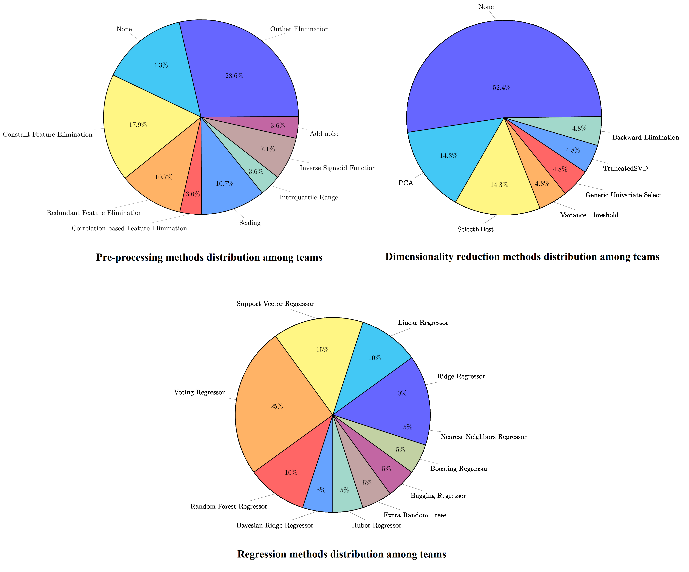
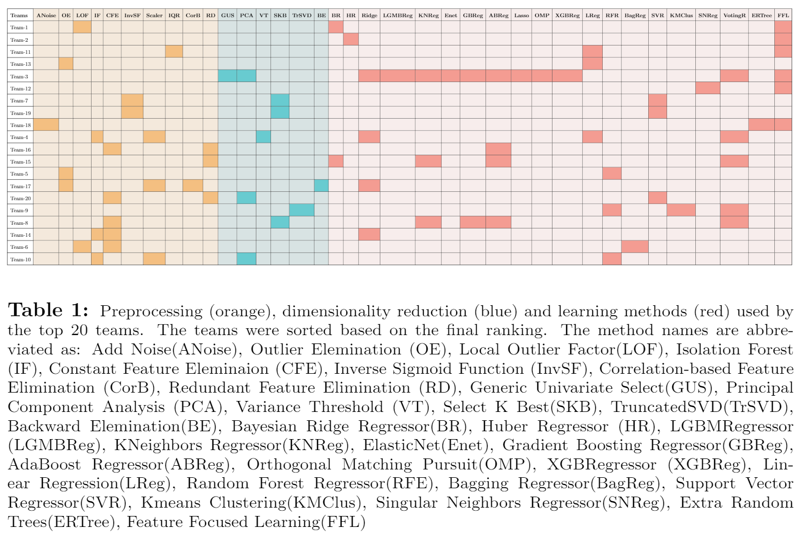
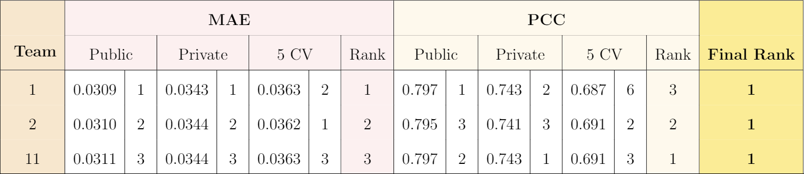

# Machine Learning Methods for Brain Connectivity Evolution Prediction from a Single Observation
==============================================================

The BrainNet Prediction Toolbox is a compilation of the proposed ML pipelines for predicting the evolution of brain connectivity maps.
Pipelines consisting of data pre-processing, dimensionality reduction and regression models are created using ML libraries such as scikit-learn <https://scikit-learn.org/stable/index.html>, and xgboost <https://xgboost.ai/>.

# Predicting Brain Roadmaps

Predicting the evolution of the brain network, also called connectome, by foreseeing changes in the connectivity weights linking pairs of anatomical regions makes it possible to spot connectivity-related neuroogical disorders in earlier stages and detect the development of potential connectomic anomalies. Remarkably, such a challenging prediction problem remains least explored in the predictive connectomics literature. It is a known fact that machine learning (ML) methods have proven their predictive abilities in a wide variety of computer vision problems. However, ML techniques specifically tailored for the prediction of brain connectivity evolution trajectory from a single timepoint are almost absent.

To fill this gap in the literature, an in-class **Kaggle challenge** is organized where we encouraged the participating teams to experiment with various machine learning
methods. The 20 competing teams developed their own pipelines to predict the connectivity map at a follow-up timepoint given the connectivity map at an initial
timepoint. **The pipelines of the best performing 20 teams are included in this repo which involve a large variety of built-in machine learning methods for data pre-processing, dimensionality reduction and regression.**



The challenge results are evaluated in 3 different experimental setups and the teams are ranked based on their MAE and PCC scores:
* **Public scores:** Scores on the first half of the test set. Teams were able to examine their public scores and rank during the competition.
* **Private scores:** Scores on the hidden part of the test set. Teams were unable to see their results on this part before competition ends.
* **5F CV scores:** Scores on the 5F CV on given training set. 

Teams are first ranked based on their MAE and PCC scores separately for each setup having 6 different rankings. Then the overall ranks are determined based on the average of these
ranks. So that the results better reveal the generalizability of the proposed pipelines on both training and test sets. Team ranks and employed methods are given at table below.



The scores and rankings of top-3 teams are given below.



# Installation

The source codes have been tested with Python 3.7. There is no need of GPU to run the codes.

Required Python Modules:

* csv
* numpy
* pandas
* scipy
* xgboost
* warnings
* matplotlib
* scikit-learn

# Dataset format

The brain connectivity map dataset includes 230 subjects in total from [OASIS-2 Dataset](https://www.oasis-brains.org/) referenced below.

```
Marcus, D.S., Fotenos, A.F., Csernansky, J.G., Morris, J.C., Buckner, R.L., 2010.
Open access series of imaging studies: longitudinal mri data in nondemented and demented older adults.
Journal of cognitive neuroscience 22, 2677–2684.
```

This set consists of a longitudinal collection of 230 subjects aged 60 to 96. For each subject, T1-weighted MRI scans for 3 timepoints with interval of at least one year is included in the dataset. For the dataset used in the competition, cortical morphological networks are derived from structural T1-weighted MRIs of 2 consecutive timepoints (t0 and t1) for each subject. These connectivity maps are represented by 595 morphological connectivity features.

The train-test split for total of 230 subjects is as follows:
- **Training set:** 150 subjects
- **Public test set:** 40 subjects
- **Private test set:** 40 subjects

Teams trained their pipelines on given t0 and t1 maps of training set. They given only the t0 maps of public test set and submitted their predictions for t1 maps to the system for evaluation and examined their results. The private test set completely kept hidden during the competition and after the competition ends, the submitted pipelines are tested also on the private test set.

# Please cite the following paper when using BrainNet-Prediction-ToolBox:

```
@article{akti2022comparative,
  title={A comparative study of machine learning methods for predicting the evolution of brain connectivity from a baseline timepoint},
  author={Akt{\'\i}, {\c{S}}eymanur and Kamar, Do{\u{g}}ay and {\"O}zl{\"u}, {\"O}zg{\"u}r An{\'\i}l and Soydemir, Ihsan and Akcan, Muhammet and Kul, Abdullah and Rekik, Islem},
  journal={Journal of neuroscience methods},
  pages={109475},
  year={2022},
  publisher={Elsevier}
}

```

# Please cite the following papers for the morphological connectomic dataset use:


```
Marcus, D.S., Fotenos, A.F., Csernansky, J.G., Morris, J.C., Buckner, R.L., 2010.
Open access series of imaging studies: longitudinal mri data in nondemented and demented older adults.
Journal of cognitive neuroscience 22, 2677–2684.
```

```
@article{mahjoub2018,
  title={Brain multiplexes reveal morphological connectional biomarkers fingerprinting late brain dementia states},
  author={Mahjoub, Ines and Mahjoub, Mohamed Ali and Rekik, Islem},
  journal={Scientific reports},
  volume={8},
  number={1},
  pages={1--14},
  year={2018},
  publisher={Nature Publishing Group}
}
```
```
@article{lisowska2019,
  title={Joint pairing and structured mapping of convolutional brain morphological multiplexes for early dementia diagnosis},
  author={Lisowska, Anna and Rekik, Islem},
  journal={Brain connectivity},
  volume={9},
  number={1},
  pages={22--36},
  year={2019},
  publisher={Mary Ann Liebert, Inc., publishers 140 Huguenot Street, 3rd Floor New~…}
}
```

# Paper link on arXiv
https://arxiv.org/abs/2109.07739
